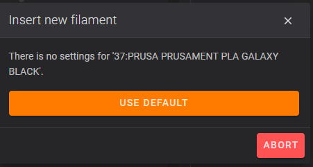
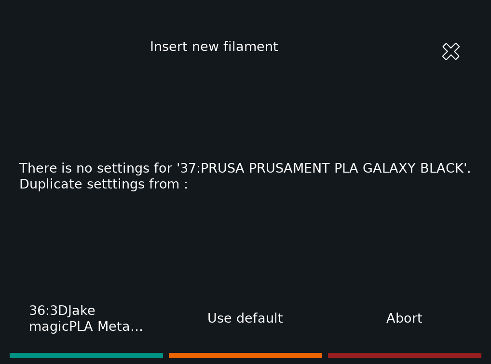
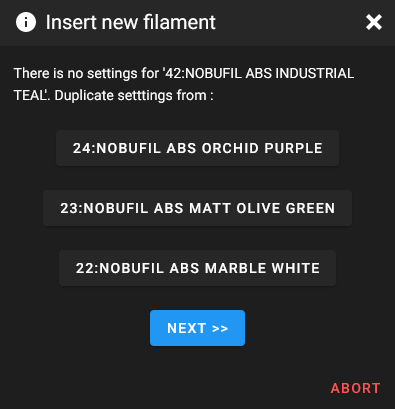

# KBobine 


>[!WARNING] 
**This repo is still at work, doc is uncomplete and code can present some
bugs, use it whith care**

Kbobine is a gateway between Spoolman and Klipper, it send current spool
informations to Klipper. Then it allows you to store settings inside Klipper
configuration.  It is compatible with Fluidd/Klipperscreen/Mainsail UI.
|  |  |  |
| ---------------------------- | ------------------------------------- | -------------------------------- |
| _Fluidd_                      | _KlipperScreen_                       | _Mainsail_                       |

### What it does ?
At Klipper startup or when a spool is selected (by UI or macro), it informs 
Klipper and send back informations from Spoolman to klipper (material, vendor,
name of the filament, ...).
Then Klipper apply settings previously set for this spool. If no information 
found, settings from equivalent spool/material/default can be imported.

### What kind of settings ?
Pressure advance and firmware retraction was the first parameters introduced in 
early version. But you can store any settings you need in your Macros.
For example, I store temperatures, filter use, filament sensor use, extrude_factor...
I use some extended functions to limit max_flow and fan_speed during the print.  

### Why store the settings inside Klipper config instead of Spoolman ?
These settings are mostly printer/toolhead dependent. It also allows you to
call settings even if connexion to spoolman is lost.

## How it works ?
KBobine use a moonraker component ``spoolman_ext.py`` to track spool change then send informations about spool to klipper.
It stores infos about spool in a saved_variable array ``kbobine_table`` once the spool is loaded. If no setting is detected, it will prompt to calibrate filament or load settings from other filaments in table.
Then it populates a ``current_settings`` array from default settings and stored settings. This array can be called from your Macros like this:

```   ```

## Configuration

Configuration is done by adjusting ``config.cfg``
### parameters 

Parameters are store in a macro named ``_KBOBINE``:

``verbose`` : 0 or 1 More verbose in console.

``autoremove_default`` 0 or 1 Autoremove settings when equal to default (see ``CLEAN_DEFAULT``)

``apply_on_load`` 0 or 1 Apply settings on load / change (see ``APPLY_SETTINGS``)

``default`` Array containing default settings. Settings can be add/remove/change be sure to modify macros ``SET_SPOOL`` and ``SET_LOADED_MATERIAL`` according this change.

``required`` A list of required settings, If a spool doesn't have this settings
a warning will prompt to add it

``th_depend`` A list of settings that depend on toolhead. For now it only check nozzle diameter, the mechanism will be improved. TO BE IMPROVE

``current_settings`` Array that contains settings used by ``APPLY_SETTINGS``

``spoolman`` contains spool id, name, vendor and material of current spool

``spool_id`` Loaded spool id

## Usage / Macros

``SET_SPOOL`` Store settings for current spool. If auto apply is enabled
the settings will be apply at change.

``SET_LOADED_MATERIAL`` Set settings to be used by printer. The difference with
previous command, it is not related to spool . The changes will not be stored.
Useful when you want to test firmare retraction for example.

``LOAD_DEFAULT_MATERIAL`` Load default filament settings instead of spool settings.

``APPLY_SETTINGS`` Apply settings or enable/disable automatic apply on load/change. 

``GET_SPOOL`` Display current spool settings in console.

``GET_LOADED_MATERIAL`` Display actual loaded settings in console.

``DEL_SPOOL`` Delete spool settings from ``kbobine_table``.

``CLEAN_DEFAULT`` Remove settings from `kbobine_table`` for current filament if same as default value .

## Includes

``core/*`` function config files

``addons/save_variables.cfg`` to include if there's no \[saved_variable\] section in the config.

``klippain.cfg`` an experimental feature that populate ``material_parameters`` variable of Klippain with stored settings. Allowed settings : 'pressure_advance', 'retract_length', 'unretract_extra_length', 'retract_speed', 'unretract_speed', 'filter_speed', 'additional_z_offset', 'filament_sensor'. 
Initial ``material_parameters`` is used as reference according material type from Spoolman

``addons/max_flow.cfg`` experimental feature that limit max_flow. It requires some changes in slicer in order to work.

``addons/fan_speed.cfg`` experimental feature to scale the partfan speed. It requires some changes in slicer in order to work.
